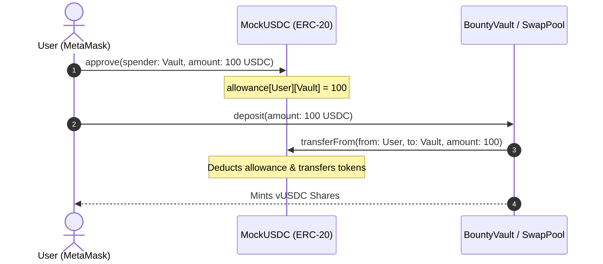
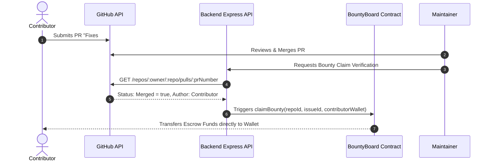

# 🎓 GitBountys: Complete Viva & DeFi / Blockchain Theory Master Guide

> A comprehensive, examiner-ready reference manual covering **everything** implemented in the **GitBountys** platform — complete with straight-to-the-point viva questions, answers, and in-depth DeFi theory (ERC-20, WETH, ERC-4626 Vaults, AMM Constant Product Math, and Escrow Mechanics).

---

## 📑 Table of Contents
1. [Platform Architecture & Tech Stack](#1-platform-architecture--tech-stack)
2. [Rapid-Fire Viva Questions & Straight-to-the-Point Answers](#2-rapid-fire-viva-questions--straight-to-the-point-answers)
   - [A. System & Workflow](#a-system--workflow)
   - [B. Smart Contracts & Escrow (`BountyBoard.sol`)](#b-smart-contracts--escrow-bountyboardsol)
   - [C. DeFi Vault System (`BountyVault.sol`)](#c-defi-vault-system-bountyvaultsol)
   - [D. AMM & DEX (`LocalSwapPool.sol`)](#d-amm--dex-localswappoolsol)
   - [E. Backend, GitHub OAuth & PR Verification](#e-backend-github-oauth--pr-verification)
   - [F. Frontend, Web3 Providers & Wallet UX](#f-frontend-web3-providers--wallet-ux)
   - [G. Security, Reentrancy & Edge Cases](#g-security-reentrancy--edge-cases)
3. [Deep-Dive Theory: ERC-20 & Tokenomics](#3-deep-dive-theory-erc-20--tokenomics)
   - [Fixed-Point Integer Math & Decimals](#fixed-point-integer-math--decimals)
   - [The Two-Step Allowance Pattern (`approve` + `transferFrom`)](#the-two-step-allowance-pattern-approve--transferfrom)
   - [Wrapped Ether (WETH9): Why Native ETH Cannot Be in Pools Directly](#wrapped-ether-weth9-why-native-eth-cannot-be-in-pools-directly)
4. [Deep-Dive Theory: ERC-4626 Tokenized Vaults (`BountyVault.sol`)](#4-deep-dive-theory-erc-4626-tokenized-vaults-bountyvaultsol)
   - [Why ERC-4626 Exists](#why-erc-4626-exists)
   - [Assets vs. Shares](#assets-vs-shares)
   - [The 4 Core Operations: Deposit, Mint, Withdraw, Redeem](#the-4-core-operations-deposit-mint-withdraw-redeem)
   - [Share-to-Asset Valuation Math](#share-to-asset-valuation-math)
   - [Step-by-Step Scenario: How Yield Harvesting Works](#step-by-step-scenario-how-yield-harvesting-works)
5. [Deep-Dive Theory: AMM & Constant Product Math (`LocalSwapPool.sol`)](#5-deep-dive-theory-amm--constant-product-math-localswappoolsol)
   - [Order Books vs. Automated Market Makers (AMM)](#order-books-vs-automated-market-makers-amm)
   - [The Constant Product Invariant ($x \cdot y = k$)](#the-constant-product-invariant-x-cdot-y--k)
   - [How Liquidity Is Supplied & Increased](#how-liquidity-is-supplied--increased)
   - [Swap Formula with 0.30% Fee Derivation](#swap-formula-with-030-fee-derivation)
   - [Slippage, Front-Running & `minAmountOut`](#slippage-front-running--minamountout)
6. [Web2-to-Web3 Bridging & Verification Mechanics](#6-web2-to-web3-bridging--verification-mechanics)
7. [Quick Reference Cheat Sheet for Viva](#7-quick-reference-cheat-sheet-for-viva)

---

## 1. Platform Architecture & Tech Stack

```
                               ┌──────────────────────────────────────────────┐
                               │             React 19 Frontend UI             │
                               │  (Vite, Ethers.js, Lucide, Glassmorphism)   │
                               └───────┬──────────────────────────────┬───────┘
                                       │                              │
                        JSON-RPC / Web3 Signer                REST API / OAuth
                                       │                              │
                                       ▼                              ▼
┌──────────────────────────────────────────────┐   ┌──────────────────────────────────────────┐
│          EVM Blockchain / Hardhat            │   │           Node.js / Express API          │
│                                              │   ├──────────────────────────────────────────┤
│  1. BountyBoard.sol (Escrow & Registry)      │   │ • GitHub OAuth / Access Token Exchange   │
│  2. BountyVault.sol (ERC-4626 Yield Vault)   │   │ • Octokit PR & Issue Verification        │
│  3. LocalSwapPool.sol (x * y = k AMM Pool)   │   │ • MongoDB Cache (Metadata & Sync)        │
│  4. WETH9 / MockERC20 (GGP, WBTC, USDC)      │   └──────────────────────────────────────────┘
└──────────────────────────────────────────────┘
```

- **Smart Contracts:** Solidity (`^0.8.24`), OpenZeppelin Contracts (ERC20, ERC4626), Hardhat.
- **Backend:** Node.js, Express, MongoDB (Mongoose), GitHub REST API (Octokit), Axios, CORS.
- **Frontend:** React 19, Vite, Ethers.js v6, CSS Design System (Spotify-inspired dark theme).
- **Target Chains:** Hardhat Localhost (`ChainID: 31337`) / Filecoin Calibration Testnet (`ChainID: 314159`).

---

## 2. Rapid-Fire Viva Questions & Straight-to-the-Point Answers

### A. System & Workflow

#### Q1: What is GitBountys, and what core problem does it solve?
> **Answer:** GitBountys is a decentralized micro-grant and bounty platform connecting GitHub open-source repositories to smart contract escrow. It eliminates payment friction and trust deficits between open-source project maintainers and developers by holding reward funds in automated, on-chain escrow until code contributions are verified and merged.

#### Q2: What is the end-to-end lifecycle of a bounty on GitBountys?
> **Answer:**
> 1. **Repo Registration:** Maintainer logs in via GitHub OAuth + MetaMask and registers their GitHub repository ID on `BountyBoard.sol`.
> 2. **Bounty Funding:** Maintainer/Sponsor deposits native ETH/FIL or tokens to fund an issue; funds are locked in the escrow contract.
> 3. **Contribution:** Developer discovers the issue, writes code, and submits a Pull Request referencing the issue.
> 4. **Verification & Approval:** Maintainer reviews and merges the PR on GitHub.
> 5. **Payout:** The maintainer or backend triggers `claimBounty(...)` on-chain, which validates permissions and transfers funds directly to the contributor's wallet.

---

### B. Smart Contracts & Escrow (`BountyBoard.sol`)

#### Q3: How does `BountyBoard.sol` prevent issue ID collisions across different repositories?
> **Answer:** It uses a composite hash key generated via `keccak256(abi.encodePacked(repoId, issueId))`. Because `repoId` (GitHub's unique numerical ID) is prepended to `issueId`, issue #1 in Repo A generates a completely distinct hash key from issue #1 in Repo B.

#### Q4: How are bounty funds locked and released?
> **Answer:**
> - **Locking:** `createBounty(repoId, issueId, issueUrl)` is marked `payable`. The caller's `msg.value` is stored in the contract balance, and `bounty.amount` records the locked amount.
> - **Release:** `claimBounty(repoId, issueId, recipient)` checks that `msg.sender` is the `repo.owner` or `bounty.creator`, marks `bounty.claimed = true`, and transfers funds to `recipient.call{value: amount}("")`.

#### Q5: Can a bounty be funded again after being claimed?
> **Answer:** Yes. In `createBounty`, the condition `require(isNewBounty || bounty.claimed, 'Bounty already exists')` allows re-funding an issue only if its previous bounty was already resolved and paid out.

#### Q6: What is the purpose of `donateToRepo(repoId)` in `BountyBoard`?
> **Answer:** It allows donors/patrons to tip or fund a repository's general treasury without tying it to a single issue. The funds are tracked in `repos[repoId].pool`.

---

### C. DeFi Vault System (`BountyVault.sol`)

#### Q7: What standard does `BountyVault.sol` implement?
> **Answer:** It implements the **ERC-4626 Tokenized Vault Standard**, an extension of ERC-20. It accepts an underlying asset (such as `MockUSDC`) and mints yield-bearing `vUSDC` (GitBountys Vault Shares) to depositors.

#### Q8: What does the custom `harvestYield(uint256 yieldAmount)` function do?
> **Answer:** Sponsors or repo owners deposit underlying tokens into the vault without receiving newly minted shares. This increases `totalAssets()` while keeping `totalSupply()` constant, raising the share exchange rate for all existing share holders.

#### Q9: How do contributors profit from holding vault shares?
> **Answer:** When contributors receive bounty payments in vault shares or deposit their rewards into the vault, they hold `vUSDC`. As sponsors inject bonus yields or interest accrues, each `vUSDC` share becomes redeemable for a greater quantity of underlying USDC upon calling `withdraw()` or `redeem()`.

---

### D. AMM & DEX (`LocalSwapPool.sol`)

#### Q10: What AMM algorithm does `LocalSwapPool.sol` implement?
> **Answer:** It implements the Uniswap v2 **Constant Product Market Maker formula ($x \cdot y = k$)** with a **0.30% swap fee**.

#### Q11: What is the exact swap formula used in `LocalSwapPool.sol`?
> **Answer:**
> $$\text{amountOut} = \frac{\text{amountIn} \times 997 \times \text{reserveOut}}{(\text{reserveIn} \times 1000) + (\text{amountIn} \times 997)}$$

#### Q12: How does `LocalSwapPool` prevent slippage and sandwich attacks?
> **Answer:** The swapping functions accept a parameter `minAmountOut` specified by the user. The contract asserts `require(amountOut >= minAmountOut, "Slippage exceeded")`. If market shifts or front-running cause the realized output to fall below `minAmountOut`, the entire transaction reverts.

---

### E. Backend, GitHub OAuth & PR Verification

#### Q13: Why is a backend required if the contracts are already on-chain?
> **Answer:**
> 1. **GitHub OAuth & Secrets:** Securely exchanges OAuth codes for GitHub user tokens using `GITHUB_CLIENT_SECRET` (which must never be exposed on the frontend).
> 2. **GitHub API Proxy:** Verifies commit authors, PR merge statuses, and repo metadata from GitHub.
> 3. **Performance & Indexing:** Provides fast search, filtering (by language, tags, payout), and caching in MongoDB so the frontend doesn't need to make hundreds of slow blockchain RPC calls.

#### Q14: How does the backend verify that a pull request resolved an issue?
> **Answer:** It queries GitHub's REST API `/repos/{owner}/{repo}/pulls`, checks if `pull_request.merged === true`, scans commit messages and PR descriptions for closing references (e.g. `Fixes #10`, `Closes #10`), and verifies that the PR author's GitHub username matches the registered contributor profile.

---

### F. Frontend, Web3 Providers & Wallet UX

#### Q15: How does `walletService.js` interact with MetaMask?
> **Answer:** It creates an `ethers.BrowserProvider(window.ethereum)` to communicate with the user's browser wallet, requests user accounts with `eth_requestAccounts`, checks the network `chainId`, and prompts the wallet to switch or add the target network via `wallet_switchEthereumChain`.

#### Q16: How are contract calls differentiated between read and write operations?
> **Answer:**
> - **Read calls** (e.g., `getBounty`, `getVaultDetails`) use a read-only Provider; they execute locally on the node via `eth_call` without gas costs.
> - **Write calls** (e.g., `createBounty`, `claimBounty`, `deposit`) require a Signer (`await provider.getSigner()`); they prompt the user to sign a transaction, consume gas, and alter on-chain state.

---

### G. Security, Reentrancy & Edge Cases

#### Q17: How is the Checks-Effects-Interactions (CEI) pattern applied in `claimBounty`?
> **Answer:**
> 1. **Checks:** Asserts `recipient != address(0)`, `bounty.exists`, `!bounty.claimed`, and caller authorization.
> 2. **Effects:** Updates state **before** sending funds: sets `bounty.claimed = true` and `bounty.recipient = recipient`.
> 3. **Interactions:** Executes external transfer: `(bool sent, ) = recipient.call{value: amount}("")`.
> 
> *If an attacker attempts a recursive reentrancy fallback, the second call fails immediately at the Check `!bounty.claimed`.*

#### Q18: Why is `recipient.call{value: amount}("")` preferred over `recipient.transfer(amount)`?
> **Answer:** `transfer()` and `send()` forward a fixed gas stipend of only 2300 gas, which breaks if the recipient is a smart contract wallet (e.g., Gnosis Safe, Account Abstraction contract) that requires more gas to execute logic. `.call{value: amount}("")` forwards all remaining gas and returns a boolean status checked by `require(sent, "Transfer failed")`.

---

## 3. Deep-Dive Theory: ERC-20 & Tokenomics

### Fixed-Point Integer Math & Decimals
Solidity has **no floating-point numbers** (no floats or doubles) to guarantee deterministic execution across all nodes. All token quantities are represented as unsigned integers (`uint256`) scaled by a `decimals` factor:

$$\text{Raw Integer} = \text{Human Value} \times 10^{\text{decimals}}$$

In our deployment script ([deploy.js](file:///c:/Users/Aadi/Desktop/Labs/ETH-Global-25-GolGappe/chain/scripts/deploy.js)):
- **GGP (GolGappe Token):** 18 decimals ($1 \text{ GGP} = 10^{18} \text{ units}$)
- **WETH (Wrapped Ether):** 18 decimals ($1 \text{ WETH} = 10^{18} \text{ wei}$)
- **WBTC (Wrapped Bitcoin):** 8 decimals ($1 \text{ WBTC} = 10^8 \text{ satoshis}$)
- **USDC (Mock USD Coin):** 6 decimals ($1 \text{ USDC} = 10^6 \text{ micro-units} = 1,000,000$)

---

### The Two-Step Allowance Pattern (`approve` + `transferFrom`)
When a smart contract (like `LocalSwapPool` or `BountyVault`) needs to pull tokens from a user's wallet, it cannot simply take them. ERC-20 enforces a two-step handshake:



1. **Step 1 (`approve`):** User authorizes `spender` contract to transfer up to `amount`.
2. **Step 2 (`transferFrom`):** The contract calls `token.transferFrom(user, contractAddress, amount)` inside its execution flow.

---

### Wrapped Ether (WETH9): Why Native ETH Cannot Be in Pools Directly
Native ETH is the base currency of Ethereum, but it **does not conform to the ERC-20 interface** (it has no `transfer()`, `transferFrom()`, or `approve()` methods).

To allow ETH to be traded uniformly in standard AMMs alongside tokens like USDC or GGP, we wrap ETH using **WETH9**:
- **Deposit (Wrap):** Sending native ETH to WETH9 executes `deposit()`, which mints an equivalent amount of WETH tokens 1:1.
- **Withdraw (Unwrap):** Calling `withdraw(wad)` burns `wad` WETH tokens and returns raw native ETH 1:1.

---

## 4. Deep-Dive Theory: ERC-4626 Tokenized Vaults (`BountyVault.sol`)

### Why ERC-4626 Exists
Before ERC-4626, every DeFi lending and yield protocol (Compound cTokens, Aave aTokens, Yearn yVaults) implemented custom, incompatible interfaces. **ERC-4626 is the Gold Standard for Tokenized Yield-Bearing Vaults**, providing a single universal interface for deposits, withdrawals, and share valuations.

```
┌────────────────────────────────────────────────────────┐
│                   BountyVault (vUSDC)                  │
├──────────────────────────┬─────────────────────────────┤
│ Underlying Asset (USDC)  │ Vault Shares (vUSDC)        │
│ Total Deposited Capital  │ Pro-rata ownership units    │
└──────────────────────────┴─────────────────────────────┘
```

---

### Assets vs. Shares
- **Underlying Asset (`asset()`):** The actual ERC-20 token being stored and managed (in our app: `MockUSDC`).
- **Vault Share (`vUSDC`):** The ERC-20 token minted to users representing fractional claim on the pool's total assets.

---

### The 4 Core Operations: Deposit, Mint, Withdraw, Redeem

| Function | What You Input | What You Get | Who Calculates What |
| :--- | :--- | :--- | :--- |
| **`deposit(assets, receiver)`** | Exact Assets to deposit | Computed Shares minted | User specifies USDC $\to$ Vault calculates vUSDC |
| **`mint(shares, receiver)`** | Exact Shares to receive | Computed Assets transferred | User specifies vUSDC $\to$ Vault pulls required USDC |
| **`withdraw(assets, receiver, owner)`** | Exact Assets to withdraw | Computed Shares burned | User specifies USDC $\to$ Vault burns necessary vUSDC |
| **`redeem(shares, receiver, owner)`** | Exact Shares to burn | Computed Assets returned | User specifies vUSDC $\to$ Vault returns proportional USDC |

---

### Share-to-Asset Valuation Math

$$\text{Share Exchange Rate} = \frac{\text{totalAssets()}}{\text{totalSupply()}}$$

$$\text{Shares to Mint} = \frac{\text{Assets Deposited} \times (\text{totalSupply} + 10^0)}{\text{totalAssets} + 1}$$

$$\text{Assets Returned} = \frac{\text{Shares Burned} \times (\text{totalAssets} + 1)}{\text{totalSupply} + 10^0}$$

*(The $+1$ offset is OpenZeppelin's standard protection against ERC-4626 vault inflation attacks).*

---

### Step-by-Step Scenario: How Yield Harvesting Works

Here is the exact mathematical progression of what happens in GitBountys when users deposit and a sponsor injects yield:

#### Step 1: Initial State (Empty Vault)
- `totalAssets() = 0 USDC`
- `totalSupply() = 0 vUSDC`

#### Step 2: Contributor Alice deposits 100 USDC
- Alice transfers 100 USDC ($100 \times 10^6$ units).
- Initial exchange rate is 1:1.
- Alice receives **100 vUSDC shares**.
- **Vault State:** `totalAssets = 100 USDC`, `totalSupply = 100 vUSDC`.
- *Alice's share value = $\frac{100}{100} \times 100 = 100 \text{ USDC}$.*

#### Step 3: Contributor Bob deposits 100 USDC
- Bob transfers 100 USDC.
- Exchange rate is still 1:1.
- Bob receives **100 vUSDC shares**.
- **Vault State:** `totalAssets = 200 USDC`, `totalSupply = 200 vUSDC`.
- *Total shares = 200 (Alice: 50%, Bob: 50%).*

#### Step 4: A Sponsor / Project Owner calls `harvestYield(100 USDC)`
- Sponsor transfers 100 USDC into the vault **without minting any new shares**.
- **Vault State:**
  - `totalAssets() = 200 + 100 = 300 USDC`
  - `totalSupply() = 200 vUSDC (unchanged!)`
- **New Share Exchange Rate:**
  $$\text{Rate} = \frac{300 \text{ USDC}}{200 \text{ vUSDC}} = 1.50 \text{ USDC per share}$$

#### Step 5: Alice Redeems Her 100 vUSDC Shares
- Alice calls `redeem(100 shares)`:
  $$\text{Assets} = 100 \text{ shares} \times 1.50 \text{ USDC/share} = 150 \text{ USDC}$$
- Alice deposited **100 USDC** and withdraws **150 USDC** (**+50% pure yield!**).

---

## 5. Deep-Dive Theory: AMM & Constant Product Math (`LocalSwapPool.sol`)

### Order Books vs. Automated Market Makers (AMM)
- **Traditional Order Books (Centralized / L2):** Require active market makers to post bid/ask orders. On-chain order books on L1 suffer from prohibitive gas fees and network latency.
- **Automated Market Makers (AMM):** Replace order books with mathematical liquidity pools. Smart contracts hold reserves of two tokens, and prices adjust automatically based on trade volume and reserve ratios.

---

### The Constant Product Invariant ($x \cdot y = k$)

```
 Token1 Reserve (y)
   │
   │  ● (Initial State: x0, y0) -> x0 * y0 = k
   │   \
   │    \  Swap Δx in -> Pool gets x0 + Δx
   │     \
   │      ● (New State: x1, y1) -> Pool returns Δy = y0 - y1
   │       \
   └────────┴────────────────────────── Token0 Reserve (x)
```

In any swap, the product of the reserves before and after the swap (ignoring fees) must remain constant:

$$(x + \Delta x)(y - \Delta y) = k$$

---

### How Liquidity Is Supplied & Increased

When liquidity providers supply assets (e.g. In [deploy.js](file:///c:/Users/Aadi/Desktop/Labs/ETH-Global-25-GolGappe/chain/scripts/deploy.js#L55-L60): **300 WETH** + **900,000 USDC**):

1. **Setting the Initial Price:**
   $$\text{Price of WETH} = \frac{\text{Reserve}_{\text{USDC}}}{\text{Reserve}_{\text{WETH}}} = \frac{900,000 \text{ USDC}}{300 \text{ WETH}} = 3,000 \text{ USDC per WETH}$$

2. **Supplying More Liquidity (e.g., Adding $100 USD worth):**
   - The contract transfers tokens in and updates reserves:
     ```solidity
     reserve0 += amount0;
     reserve1 += amount1;
     ```
   - Increasing reserves increases the invariant $k = \text{reserve0} \times \text{reserve1}$.
   - **Higher $k$ means greater market depth and significantly lower slippage for future traders.**

---

### Swap Formula with 0.30% Fee Derivation

Our contract charges a 0.30% transaction fee that stays in the pool to incentivize liquidity providers.

1. If a user inputs $\Delta x$ (`amountIn`), the effective input after 0.3% fee is:
   $$\Delta x_{\text{withFee}} = \Delta x \times (1 - 0.003) = \Delta x \times 0.997 = \frac{\Delta x \times 997}{1000}$$

2. Using the constant product rule $(x + \Delta x_{\text{withFee}})(y - \Delta y) = x \cdot y$:
   $$y - \Delta y = \frac{x \cdot y}{x + \Delta x_{\text{withFee}}}$$
   $$\Delta y = y - \frac{x \cdot y}{x + \Delta x_{\text{withFee}}} = \frac{y(x + \Delta x_{\text{withFee}}) - x \cdot y}{x + \Delta x_{\text{withFee}}} = \frac{\Delta x_{\text{withFee}} \cdot y}{x + \Delta x_{\text{withFee}}}$$

3. Multiplying numerator and denominator by 1000 to eliminate decimals gives our exact Solidity code in [LocalSwapPool.sol](file:///c:/Users/Aadi/Desktop/Labs/ETH-Global-25-GolGappe/chain/contracts/LocalSwapPool.sol#L50-L55):

$$\Delta y = \frac{\Delta x \times 997 \times y}{(x \times 1000) + (\Delta x \times 997)}$$

```solidity
uint256 amountInWithFee = amountIn * 997;
uint256 numerator = amountInWithFee * reserveOut;
uint256 denominator = (reserveIn * 1000) + amountInWithFee;
amountOut = numerator / denominator;
```

---

### Slippage, Front-Running & `minAmountOut`

- **Price Impact:** Large trades consume a substantial portion of the pool's reserves, shifting the marginal exchange rate during the execution of the trade itself.
- **Slippage:** The difference between the expected price when a user clicks "Swap" and the actual execution price when the block is mined.
- **Protection (`minAmountOut`):**
  If Alice swaps 1 WETH expecting 3,000 USDC with a 1% slippage tolerance, the frontend sets:
  $$\text{minAmountOut} = 3000 \times (1 - 0.01) = 2,970 \text{ USDC}$$
  If a MEV bot attempts a sandwich attack or another trade front-runs Alice pushing output to 2,960 USDC, the contract triggers:
  ```solidity
  require(amountOut >= minAmountOut, "Slippage exceeded");
  ```
  and the transaction reverts, saving Alice from financial loss.

---

## 6. Web2-to-Web3 Bridging & Verification Mechanics



1. **Identity Linking:** Developers link their GitHub username with their Ethereum/Filecoin wallet address in their user profile.
2. **Deterministic Oracle Validation:** The backend inspects GitHub merge commits and PR webhooks, verifying that:
   - The Pull Request status is `closed` and `merged == true`.
   - The commit message or body contains valid resolution keywords (`Fixes #<id>`, `Resolves #<id>`).
   - The author of the PR matches the linked GitHub account of the claimant.
3. **Trustless Settlement:** Once validated, the on-chain payout occurs without intermediary custodial holding.

---

## 7. Quick Reference Cheat Sheet for Viva

| Concept | What to say in one sentence |
| :--- | :--- |
| **BountyBoard** | On-chain escrow contract that maps repository issue IDs to locked cryptocurrency funds and releases them upon verified maintainer approval. |
| **BountyVault** | An ERC-4626 yield-bearing vault that tokenizes developer bounty balances into `vUSDC` shares and inflates their exchange rate via `harvestYield()`. |
| **LocalSwapPool** | A decentralized AMM constant product liquidity pool ($x \cdot y = k$) with 0.3% fees allowing instant token swaps between WETH, USDC, and GGP. |
| **WETH** | An ERC-20 wrapper around native Ether enabling ETH to be traded inside standard decentralized liquidity pools. |
| **Checks-Effects-Interactions** | A security pattern where state variables are updated *before* making external token/ETH transfers to prevent reentrancy exploits. |
| **keccak256 ID Hashing** | Combining `repoId` and `issueId` into a 32-byte cryptographic hash to guarantee global uniqueness across all repositories. |
| **Slippage Tolerance** | Setting `minAmountOut` during token swaps so the transaction automatically aborts if unfavorable price movement occurs before mining. |
| **Dual Authentication** | Combining GitHub OAuth (for identity & PR authorization) with MetaMask (for cryptographic signature & asset custody). |
